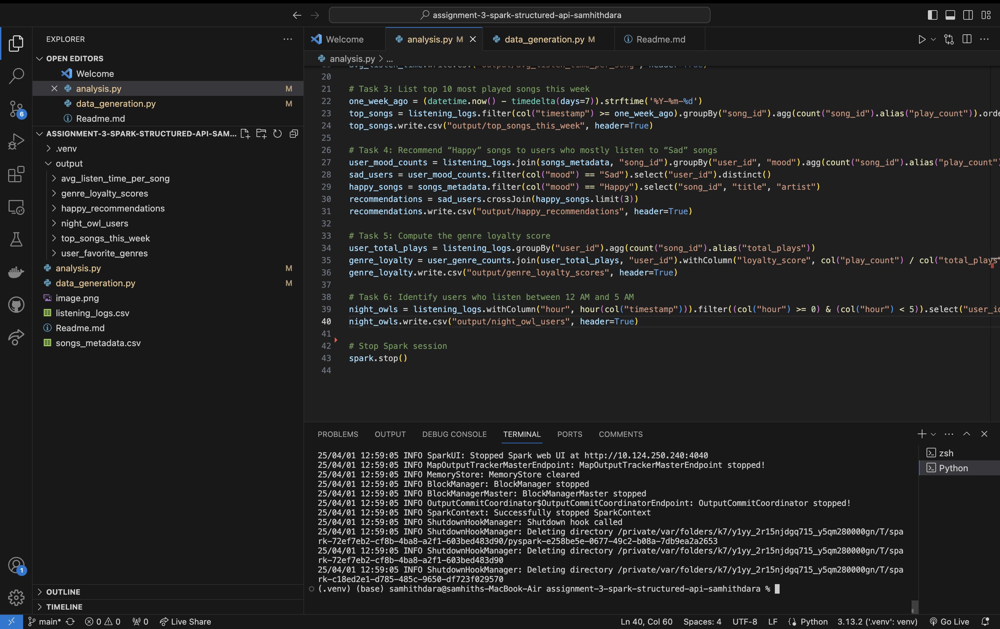

# PySpark Music Analysis

## Overview
This project analyzes music listening habits using PySpark. The dataset consists of listening logs and song metadata, and various insights are generated, such as favorite genres, average listen times, and personalized recommendations. The outputs are stored in CSV format in a structured directory.

## Datasets
1. **listening_logs.csv**
   - `user_id`: Unique identifier for users.
   - `song_id`: Unique identifier for songs.
   - `timestamp`: Date and time when the song was played.
   - `duration_sec`: Duration in seconds for which the song was played.

2. **songs_metadata.csv**
   - `song_id`: Unique identifier for songs.
   - `title`: Name of the song.
   - `artist`: Name of the artist.
   - `genre`: Genre of the song.
   - `mood`: Mood category of the song (e.g., Happy, Sad).

## Tasks and Implementations

### 1. Find Each User’s Favorite Genre
- Joins `listening_logs` with `songs_metadata`.
- Groups by `user_id` and `genre` to count plays.
- Extracts the most played genre for each user.
- Saves results to `output/user_favorite_genres/`.

### 2. Calculate the Average Listen Time Per Song
- Groups `listening_logs` by `song_id`.
- Computes the average `duration_sec`.
- Saves results to `output/avg_listen_time_per_song/`.

### 3. List the Top 10 Most Played Songs This Week
- Filters `listening_logs` for plays within the last 7 days.
- Aggregates play counts per song.
- Orders by play count and selects the top 10.
- Saves results to `output/top_songs_this_week/`.

### 4. Recommend "Happy" Songs to Users Who Mostly Listen to "Sad" Songs
- Identifies users who listen to "Sad" songs the most.
- Recommends up to 3 "Happy" songs per user.
- Saves results to `output/happy_recommendations/`.

### 5. Compute the Genre Loyalty Score for Each User
- Calculates the proportion of plays belonging to the user's most-listened genre.
- Filters users with a loyalty score above 0.8.
- Saves results to `output/genre_loyalty_scores/`.

### 6. Identify Users Who Listen to Music Between 12 AM and 5 AM
- Extracts users who played music between `00:00` and `05:00`.
- Saves results to `output/night_owl_users/`.

## Output Structure
```
output/
├── user_favorite_genres/
├── avg_listen_time_per_song/
├── top_songs_this_week/
├── happy_recommendations/
├── genre_loyalty_scores/
├── night_owl_users/
```

## Execution Commands
To run the PySpark script, use the following command:
```bash
spark-submit analysis.py
```
Or, if running in a PySpark interactive shell:
```python
spark = SparkSession.builder.appName("MusicAnalysis").getOrCreate()
exec(open("analysis.py").read())
```

## Errors and Fixes
### Issue: "COLUMN_ALREADY_EXISTS" error when writing `happy_recommendations`.
**Fix:** Renamed duplicate `user_id` column using `expr("first(user_id) as user_id")`.

### Issue: Empty output for genre loyalty score.
**Fix:** Verified data consistency and changed the loyality to 0.5 as random data had less dominant genre.

## Screenshots


